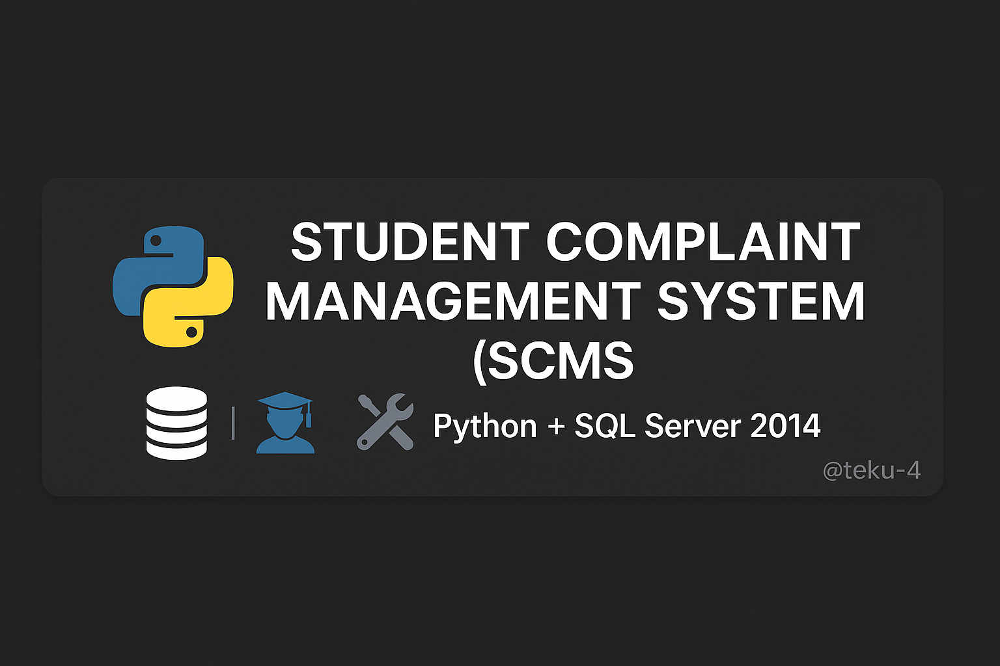
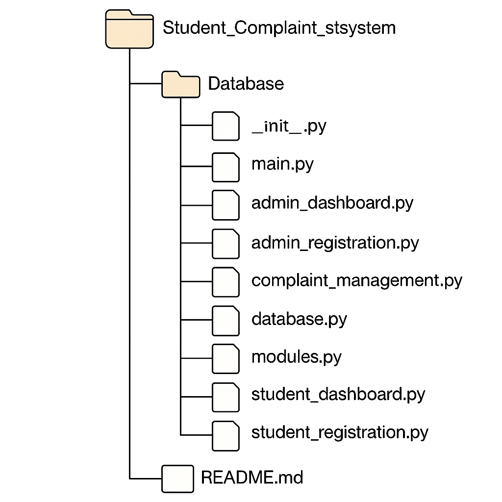

# 🎓 Student Complaint Management System (SCMS)



---

## 📑 Table of Contents
- [🌟 Overview](#-overview)
- [📂 File Structure](#-file_structure)
- [✅ Features](#-features)
- [🛠 Tech Stack](#-tech-stack)
- [⚙️ Setup Instructions](#-setup-instructions)
- [📄 License](#-license)

---

## 🌟 Overview
Welcome to the **Student Complaint Management System (SCMS)**, a robust Python-based desktop application designed to empower university students by streamlining the process of filing, tracking, and resolving complaints. With intuitive dashboards for both students and admins, role-based access control, and seamless integration with SQL Server 2014, SCMS ensures efficient complaint management and enhanced user experience.

---

## 📂 File Structure

This organized structure ensures modularity and ease of maintenance.

---

## ✅ Features
- **🎉 Student Registration & Login**: Secure sign-up and login for students.
- **🔐 Admin Login & Complaint Management**: Admin access with full complaint oversight.
- **📝 Submit & Track Complaints**: Easy submission and real-time tracking for students.
- **🎨 Role-Based Dashboards**: Tailored interfaces for students and admins.
- **🔗 SQL Server 2014 Integration**: Reliable database backend for data storage.

---

## 🛠 Tech Stack
- **🎨 Frontend**: Python Tkinter for a user-friendly desktop interface.
- **⚙️ Backend**: Python for core logic and functionality.
- **💾 Database**: SQL Server 2014 for robust data management.

---

## ⚙️ Setup Instructions
1. **Clone the Repository**:
   ```bash
   git clone git@github.com:teku-4/SCMS_python_project.py.git
   cd Student_Complaint_stsystem
MIT License

Copyright (c) 2024 Leta Kasahun

